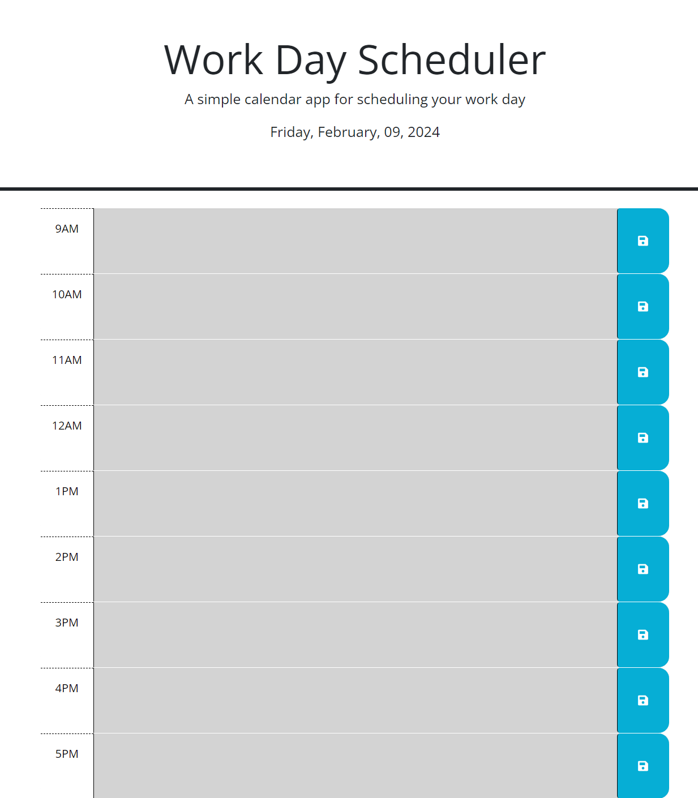

# Work-Day-Scheduler

## Work day hourly scheduler

This is a refactorization of code provided for a weekly bootcamp module challenge.

It is a work day planner that allows the user to write and save custom task descriptions in each hour of the weekday.

The planner will color code each hour based on whether it is an hour already passed, the current hour, or in the future.

## Installation

N/A

## Usage

The user can write a custom message into any of the hour blocks and when they click the save button, the message will be saved for the next time they visit the page

The web page can currently be found hosted on Github [here](https://stephen-bates.github.io/Work-Day-Scheduler/)

It should resemble the image below:

## Credits

Original HTML and CSS provided by edX Boot Camps LLC and is provided inside the Develop subdirectory

Javascript is my original work

## Liscense

N/A